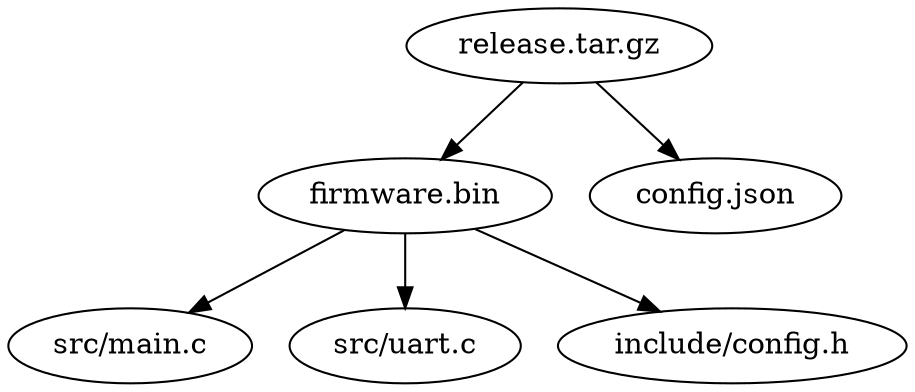

## Summary

Implement the `dk-dot` diagnostic command — emits a Graphviz DOT-format
directed graph of label-to-input dependencies. Pipe to `dot -Tsvg` for
visualization.

## Current State

Stamp reading exists in `internal/stamp/` (ticket 005). CLI dispatch exists
(ticket 007).

## Analysis & Recommendations

Per `dk-redo.md:344-360`:

```
dk-dot [labels...]       # specific labels (default: all)
```

Output format:


Exit codes:
- `0` — graph emitted
- `2` — error (no stamps, I/O error)

Flag: `--lr` for left-to-right layout (`rankdir=LR`).

Node names should be quoted to handle paths with special characters.

## TDD Plan

### RED

```go
func TestDotOutput(t *testing.T) {
    // Stamp with 3 files → valid DOT with 3 edges
}

func TestDotMultipleLabels(t *testing.T) {
    // Two stamps → both in output
}

func TestDotLRLayout(t *testing.T) {
    // --lr → rankdir=LR in output
}

func TestDotNoStamps(t *testing.T) {
    // No stamps → exit 2
}
```

### GREEN

1. Implement `runDot(args []string)` function
2. Read stamps (all or specified labels)
3. Emit DOT header with rankdir
4. For each stamp: emit edges from label to each input file
5. Emit closing brace

### REFACTOR

- Share stamp scanning with dk-affects, dk-ood, dk-sources

## Completion Notes

**Commit:** `f2514d5`

### Files modified
- `cmd/dk-redo/main.go` — `cmdDot` function added (~40 lines)

### Design decisions
- Reads stamps (all or specified labels), emits Graphviz DOT directed graph
- `rankdir=TB` by default, `--lr` flag switches to `rankdir=LR`
- Node names are quoted to handle paths with special characters
- Exit 0 = graph emitted, exit 2 = error or no stamps
- Pipe output to `dot -Tsvg` or `dot -Tpng` for visualization

### Deferred work
- No dedicated integration tests for dk-dot
- The `--lr` flag is parsed but not tested in integration tests
